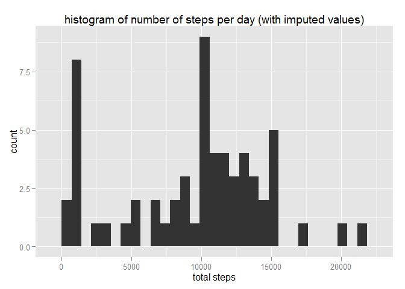

# Reproducible Research: Peer Assessment 1


## Loading and preprocessing the data
first, we want to unzip and read the data into a data.frame

```r
unzip("activity.zip")
activity <- read.csv("activity.csv")
```
verify, that something has been loaded:

```r
names(activity)
```

```
## [1] "steps"    "date"     "interval"
```

change the `date` from a factor variable to a date variable:

```r
activity$date <- as.Date(activity$date)
```


## What is mean total number of steps taken per day?

calculate the total number of steps per day:

```r
nStepsPerDay <- aggregate(activity$steps, list(activity$date), sum)
names(nStepsPerDay) <- c("Date", "total steps")
```

here is a bar bplot for the total number of steps per day:

```r
library(ggplot2)
g <- ggplot(nStepsPerDay, aes(x=Date, y = `total steps`))
g <- g + geom_bar(stat = "identity", position = "stack")
g <- g + ggtitle("number of steps per day")
g
```

```
## Warning: Removed 8 rows containing missing values (position_stack).
```

 

and here is the histogram:


```r
g <- ggplot(nStepsPerDay, aes(`total steps`))
g <- g + geom_histogram()
g <- g + ggtitle("histogram of number of steps per day")
g
```

```
## stat_bin: binwidth defaulted to range/30. Use 'binwidth = x' to adjust this.
```

 

the mean is:

```r
mean(nStepsPerDay$`total steps`, na.rm = T)
```

```
## [1] 10766.19
```

and the median is:

```r
median(nStepsPerDay$`total steps`, na.rm = T)
```

```
## [1] 10765
```


## What is the average daily activity pattern?
Because we are interested in plotting a time series, it seems like a better idea to have a rough value rather than none, so we filter out `NA` values. We get the mean number of steps per 5-minute time period. 

```r
nStepsPerTimeInterval <- aggregate(activity$steps, list(activity$interval), mean, na.rm=T)
names(nStepsPerTimeInterval) <- c("interval", "average steps")
```

here the time series of mean steps per time interval:

```r
g <- ggplot(nStepsPerTimeInterval, aes(x=interval, y = `average steps`))
g <- g + geom_line()
g <- g + ggtitle("average number of steps per time interval")
g
```

 

the interval with the most steps in average is:

```r
nStepsPerTimeInterval[which.max(nStepsPerTimeInterval$`average steps`), "interval"]
```

```
## [1] 835
```


## Imputing missing values

The number of `NA` values is:

```r
sum(is.na(activity$steps))
```

```
## [1] 2304
```

After a few exploratory plots and calculations, I chose to use the median of the time interval. The median of the day 
is not meaningful, as it is constant 0. Also, we have a very large standard deviation.

First calculate the median per interval:

```r
medianByInterval <- aggregate(activity$steps, list(round(activity$interval)), median, na.rm=T)
names(medianByInterval) <- c("interval", "steps")
```

and now fill in the missing values:

```r
imputedActivity <- rbind(
  activity[!is.na(activity$steps), ],
  merge(activity[is.na(activity$steps), c("date", "interval")], medianByInterval)
)
```

to get the histogram, we need to calculate the number of steps per day:

```r
imputedNStepsPerDay <- aggregate(imputedActivity$steps, list(imputedActivity$date), sum)
names(imputedNStepsPerDay) <- c("Date", "total steps")
```

and then we can compute the histogram:

```r
g <- ggplot(imputedNStepsPerDay, aes(`total steps`))
g <- g + geom_histogram()
g <- g + ggtitle("histogram of number of steps per day (with imputed values)")
g
```

```
## stat_bin: binwidth defaulted to range/30. Use 'binwidth = x' to adjust this.
```

 

the mean is:

```r
mean(imputedNStepsPerDay$`total steps`)
```

```
## [1] 9503.869
```

and the median is:

```r
median(imputedNStepsPerDay$`total steps`)
```

```
## [1] 10395
```

these values differ quite a from the values before imputing the missing values. The mean is a lot lower, whereas the median is somewhat similar. The impact, however, is that probably at least one of the two version has a significant bias. Our approach of adding the median value introduced a lot of days with no longer missing values, but close to 0 (look at the second bar in the histogram).

## Are there differences in activity patterns between weekdays and weekends?

First, we add a factor variable for whether or not the date is a weekday:

```r
imputedActivity$weekend <- as.factor(weekdays(imputedActivity$date) %in% c("Saturday", "Sunday"))
levels(imputedActivity$weekend) <- c("weekday", "weekend")
```

for the time series, we need to calculate the means:

```r
nStepsPerTimeIntervalByWeekday <- aggregate(imputedActivity$steps, list(imputedActivity$interval, imputedActivity$weekend), mean)
names(nStepsPerTimeIntervalByWeekday) <- c("interval", "weekday", "average steps")
```

and now we can plot the time series:

```r
g <- ggplot(nStepsPerTimeIntervalByWeekday, aes(x=interval, y = `average steps`))
g <- g + facet_grid(weekday ~ .)
g <- g + geom_line()
g <- g + ggtitle("average number of steps per time interval")
g
```

 

visually, it looks like the person tends to sleep in on weekends and get up earlier on weekdays. Look at the period shortly after 5am.
